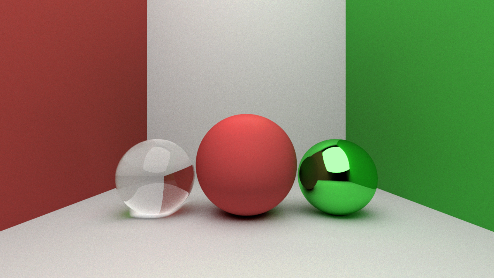

# DXProject
Building a fun, path-tracer in DX12 to get familiar with the API and to refine my compute skills.

Features implemented so far:
- Simple UAV/CBV to SRV pipeline for rendering via triangle draw
- Compute dispatch set-up for path-tracing, writing to UAV
- Naive pathtracing, able to support only diffuse and metallic materials fully so far.

